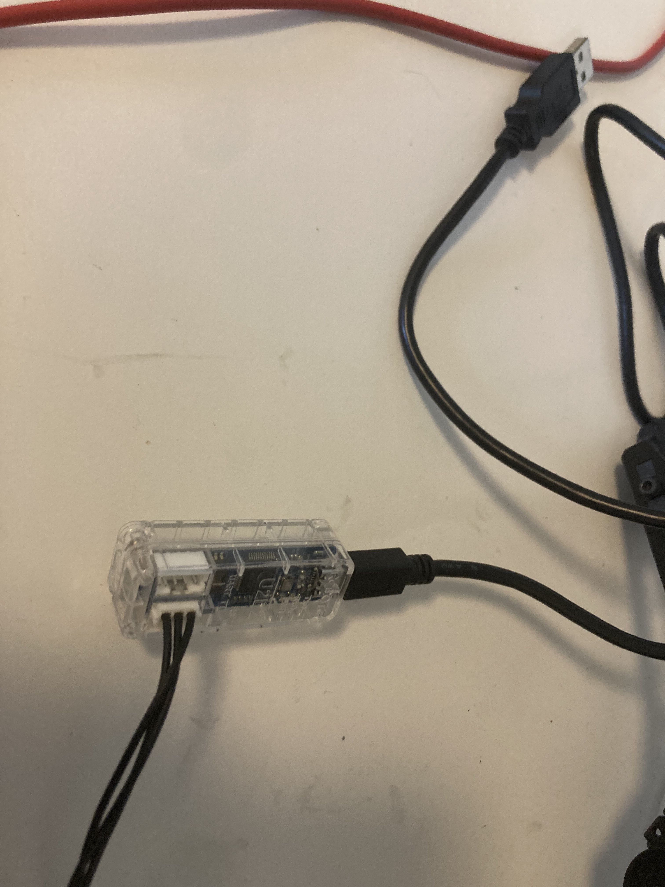
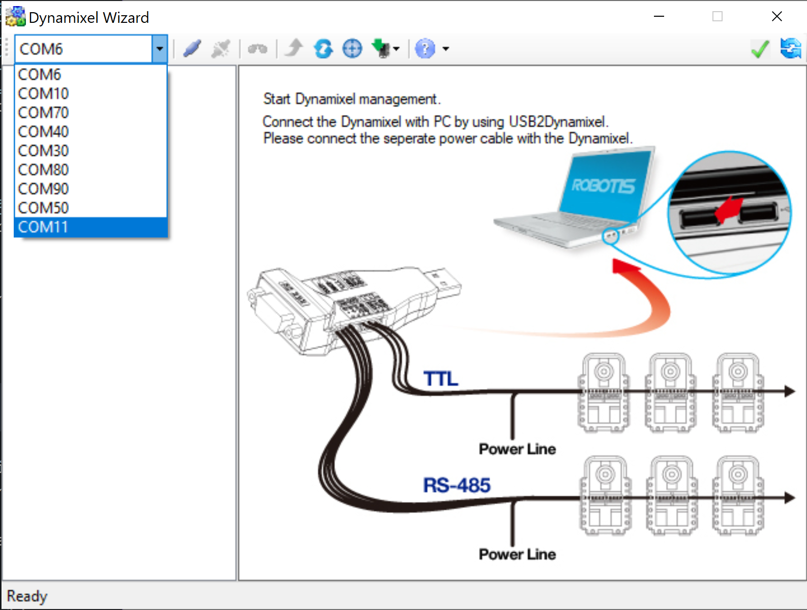
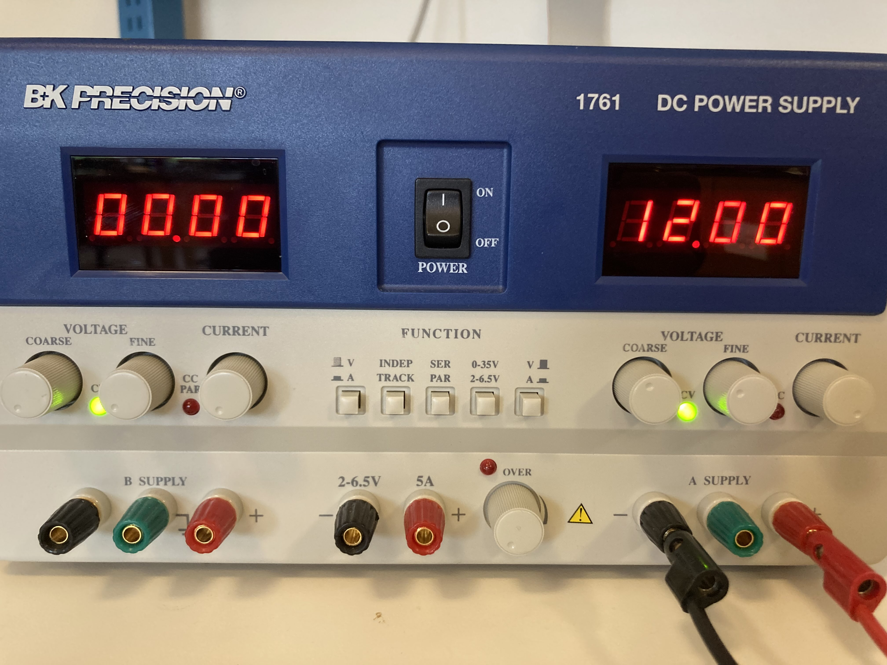
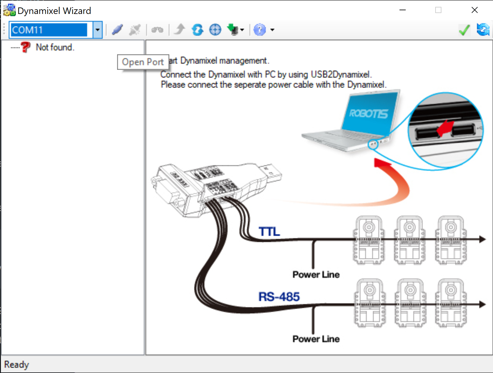
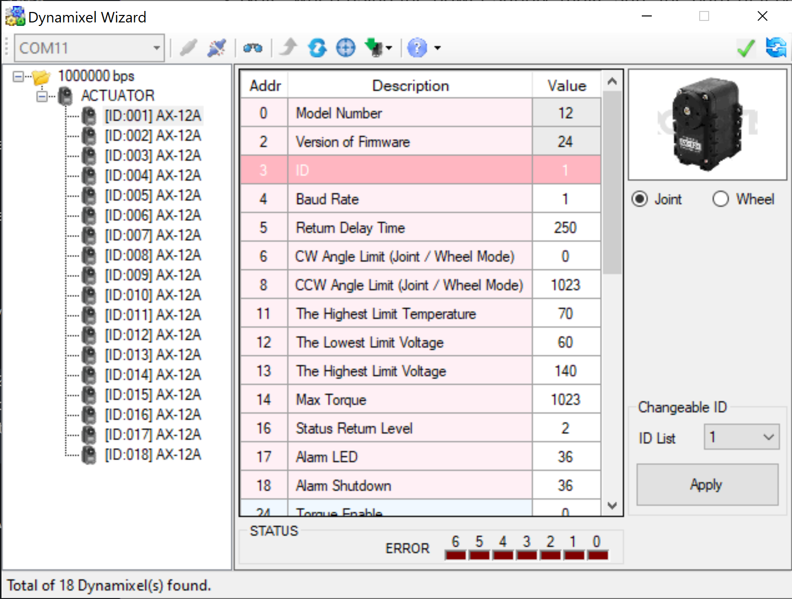
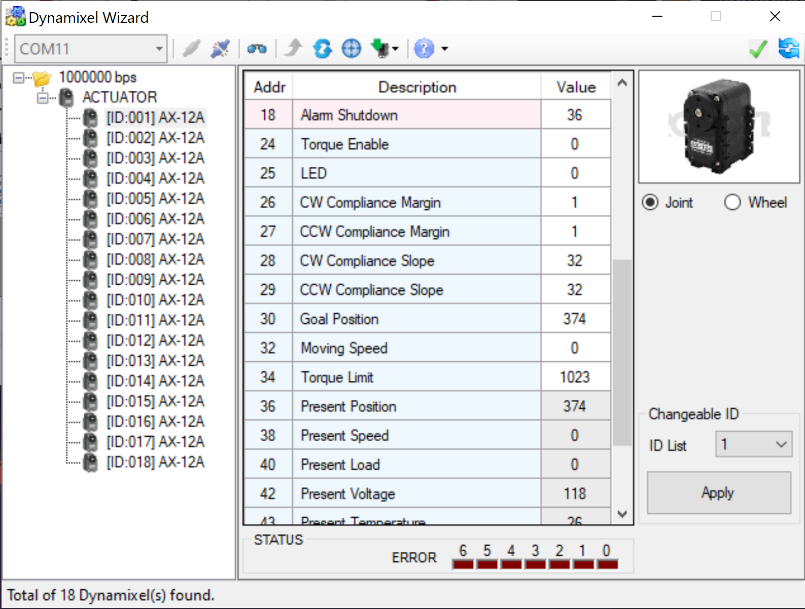
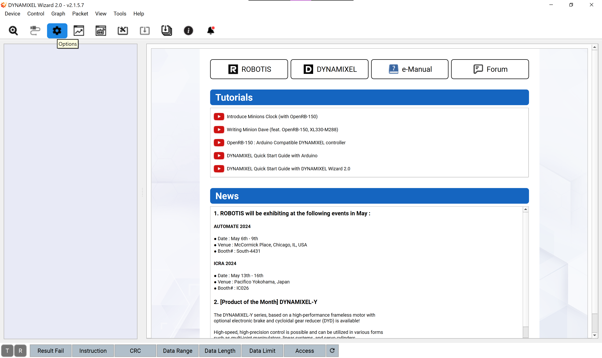
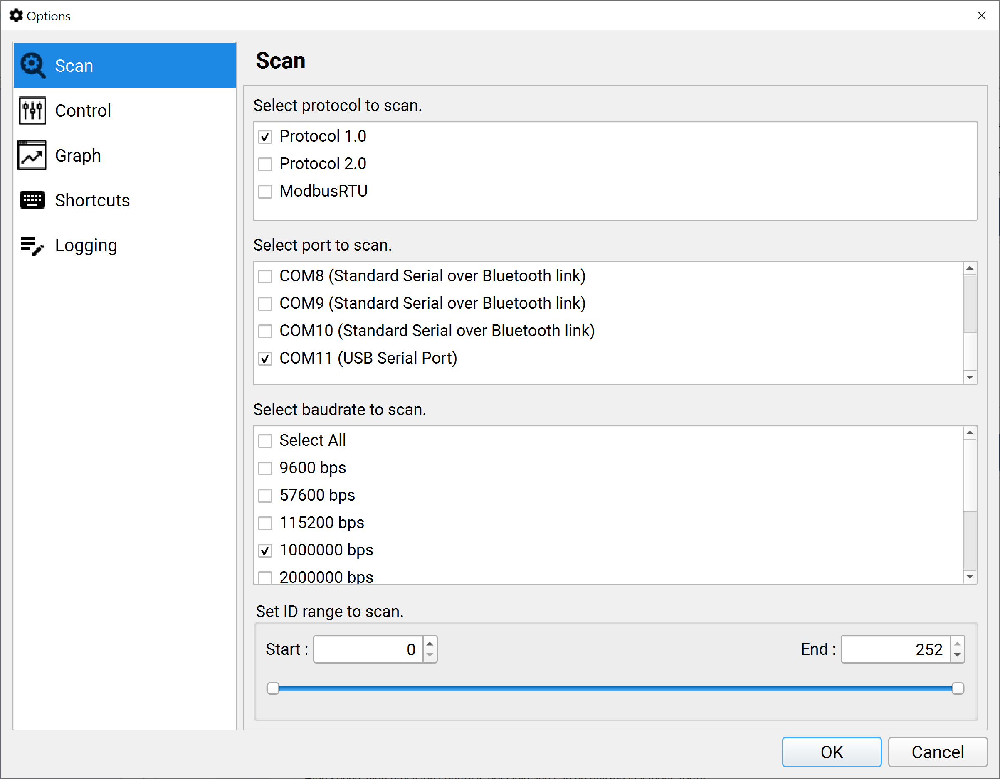
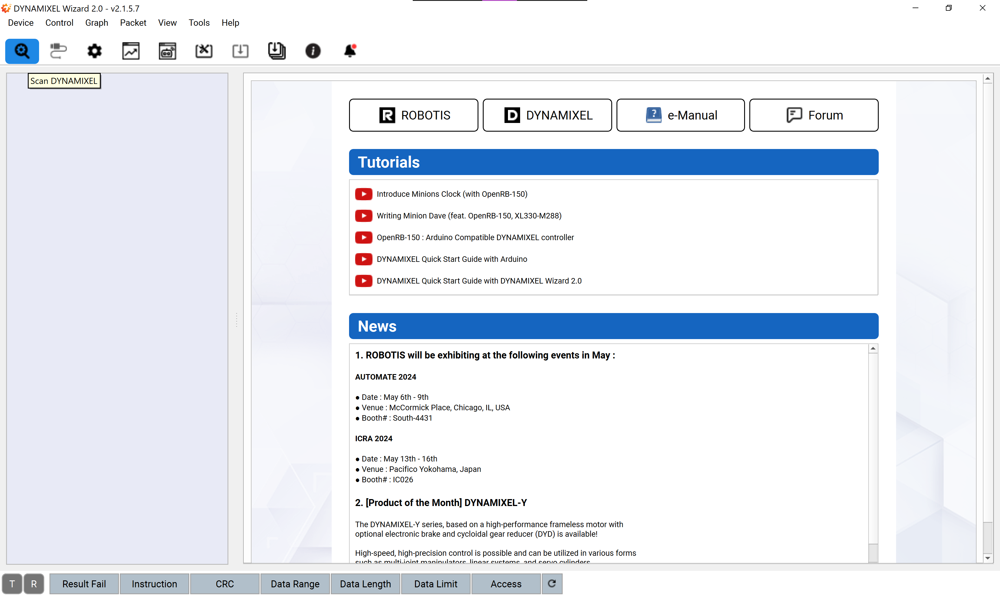
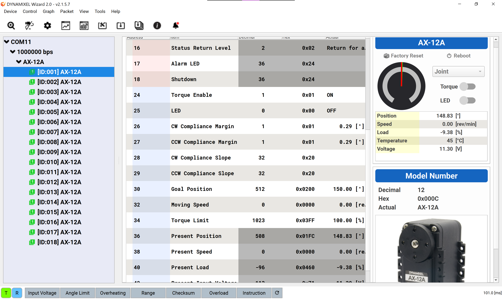

# A Step-by-Step Guide to getting started with helping Mr. Krabs walk, Python edition

## Getting Dynamixel SDK on your computer

1. Clone the [Dynamixel SDK](https://emanual.robotis.com/docs/en/software/dynamixel/dynamixel_sdk/download/#repository) and put it in a place easy to access.

2. Open Terminal (or Command Prompt) and navigate to the location the folder is in.

3. Move into the Python folder and run the setup file with `python setup.py install` (for [Windows](https://emanual.robotis.com/docs/en/software/dynamixel/dynamixel_sdk/library_setup/python_windows/#python-windows)) or `sudo python setup.py install` (for [Linux](https://emanual.robotis.com/docs/en/software/dynamixel/dynamixel_sdk/library_setup/python_linux/#python-linux)). There are no [Mac instructions](https://emanual.robotis.com/docs/en/software/dynamixel/dynamixel_sdk/library_setup/python_macos/#python-macos) as of writing this, though it's probably similar to Linux.

## Getting RoboPlus for Dynamixel Wizard

1. Going [here](https://en.robotis.com/service/downloadpage.php?ca_id=10), download **RoboPlus** located close to the bottom of the page (if you don't use a Windows machine, you can use [DYNAMIXEL Wizard 2.0](https://emanual.robotis.com/docs/en/software/dynamixel/dynamixel_wizard2/). See below for more instructions for this software).

2. After installing the program, open RoboPlus and navigate to Dynamixel Wizard. Plug in the [U2D2](https://emanual.robotis.com/docs/en/parts/interface/u2d2/) into your computer.

 <em> The U2D2 </em> 

3. Find the port that the U2D2 is using and, through the dropdown menu in the top left, select the port.

 <em> Port Selection </em> 

4. Using the 3-Pin Power hub, hook up each leg to it via daisy chain so that each leg is 3 servos chained and then it's connected back to the hub.

 <em> Servos plugged into the Power Hubs </em> 

5. Power the servos with a power supply (or a battery, but that hasn't been figured out yet) by wiring it to the 3-Pin Power hub.
    - Note: when using the power supply, make sure the current it can use is dialed up to the highest setting and the Voltage output is 12. Low current makes it so that the servos aren't supplied enough power for each to move in close succession.

 <em> Power supply settings </em> 

 <em> Setup of the power hub and power supply </em> 

1. Click the Open Port button, select 1000000 as the baud rate, DXL 1.0, and then click "Start searching." If done correctly, then each servo connected in a daisy chain to the power hub that the U2D2 is also hooked up to (can also be further daisy chained to other hubs) will show up with their respective IDs.

 <em> Port Open </em> 

 <em> Port Scan Settings </em> 

 <em> Scan Results </em> 

7. You can now change the IDs of the servos if needed (each needs a different ID number) as well as see the address table for the servo found [here](https://emanual.robotis.com/docs/en/dxl/ax/ax-12a/#control-table-data-address).

 <em> Servo IDs </em> 

 <em> Servo Address Table </em> 

8. Don't forget to close the port after finishing and before running the program as only 1 program can use the port at a time.

 <em> Port Close </em> 

## Using DYNAMIXEL Wizard 2.0
1. Download it for your OS at the same link as the one above and run the installer.

2. After opening, click on the gear to open settings.

 <em> Options </em> 

3. Change the Protocol to 1.0, the Port the U2D2 is connected to and the baudrate to 1000000.

 <em> Settings </em> 

4. Click Ok and then click the magnifying glass to start scanning.

 <em> Scan Button </em> 

5. Like the version of Dynamixel Wizard from RoboPlus, this allows you to see each servo's ID and to move them through click and drag. However this doesn't let you change the ID unless you reset the firmware.

 <em> Servo IDs </em> 

 <em> Servo Address Table </em> 

 <em> Close Port </em> 

## Running the Servo Test

1. Open the file, and change the `DEVICENAME` variable to match the U2D2 port.

2. You should be good to go if you installed the Dynamixel SDK and the servo IDs match what's in the file (if the IDs are changed, make the corresponding changes in the file).

3. Run in the terminal or by clicking the Run button in the IDE you're using.